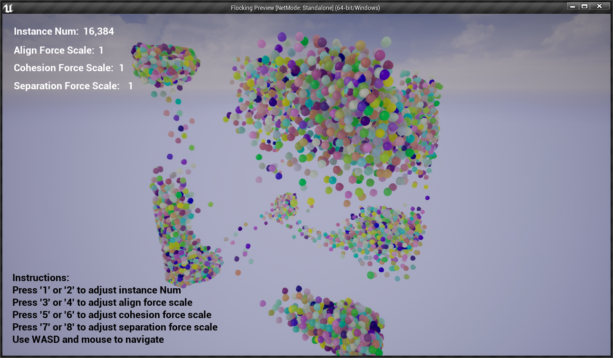

# UE4 GPGPU Flocking/Boids ComputeShader branch

This DEMO used GPGPU (compute shader) to implement boids algorithm in UE4 and achieved the flocking movement of 10,000+ objects. It runs in 60FPS on my laptop with GTX1660Ti, windows 10-64bit. The UE4 version being used is UE4 4.25.

URL of DEMO video: https://www.youtube.com/watch?v=_XHFzv3XH2o&feature=youtu.be

## Playing instruction
Using **AWSD** and mouse (the typical FPS control) to navigate the scene.   
I also provide interface allowing players to change the parameter of the boids and play with them.
1. Press **'1' or '2'** to adjust instance Num
2. Press **'3' or '4'** to adjust align force scale
3. Press **'5' or '6'** to adjust cohesion force scale
4. Press **'7' or '8'** to adjust separation force scale

## Implementation description
### 1.	Rendering boids
I did some experiments before I start to implement it. Using the spawn function to generate 1000 actors with the same staticMesh, the runtime frame rate drops to the single digits. It seems that UE4 did not batch render the 1000 identical objects. I have some experience with untiy3d, I remember there is an option to automatically batch rendering in untiy3d, but I didn't find it in unreal. Please tell me how to do that if some of you guys have experience with it.   
Then it is natural to come up with the idea that using GPU instancing to generate boids. UE4 provides a component called the instatncedStaticMesh for gpu instancing. As its name suggests, it use instancing to render large quantities of static Mesh. Calling instatncedStaticMesh: : updateInstanceTranform is very slow! So the question is, how do we get static mesh instatnces moving? I got the inspiration for this [video](https://www.youtube.com/watch?v=LQBgJBC0jhE) and this [blog](https://qiita.com/selflash/items/c937308299d93340f7c7). We can use the **world Position Offset** in the material to change the Position of each instance. Then, how to get instanceID for each instance? There is no built-in method to get the instanceID unitl UE4 4.25. Thus, author of the blog, [@selflash](https://github.com/selflash) used the position of the instance in the initialization time to calculate their instanceIDs(that is a enlightening idea).  Fortunately, during the search I found that the **Set CustomData Value** function is provided in the latest UE4 4.25 to save their own CustomData for each instance, and can be accessed in the material via **PerInstanceCCustomData**! So we can specify instanceID for every instatnces now.
### 2.	Applying GPGPU (compute shader) to update boids
Thanks for the wonderful tutorial from [@Temaran](https://github.com/Temaran), I applied compute shader to calculate velocity and position for boids in this branch of repo.
Compute shader is imported as a plugin. Velocity and position information are saved in renderTarget2Ds which is similar to master branch, but this time we use compute shader to do calculation for it and use customized vertex and fragment shader to upate the renderTarget2Ds.

## Future works
Using spatial hashing algorithm to do optimization and achieve more boids.

## References
[THE NATURE OF CODE Chapter 6. Autonomous Agents](https://natureofcode.com/book/chapter-6-autonomous-agents/)   
[Manipulate 125,000 Cubes with GPGPU - Unreal Engine 4](https://www.youtube.com/watch?v=LQBgJBC0jhE)   
[[UE4]ブループリントだけでGPGPUをしよう ~ その1 インスタンスIDを割り振る ~](https://qiita.com/selflash/items/c937308299d93340f7c7)   
Many thanks to [@selflash](https://github.com/selflash) for helping me solve the problem of floating point texture accuracy!   
[Pixel and Compute Shaders in UE4](https://forums.unrealengine.com/development-discussion/c-gameplay-programming/29352-tutorial-pixel-and-compute-shaders-in-ue4)   
[500,000 boids simulated with a compute shader](https://www.reddit.com/r/Unity3D/comments/c874d9/500000_boids_simulated_with_a_compute_shader/)   
[Scalable GPU Fluid Simulation](https://wickedengine.net/2018/05/21/scalabe-gpu-fluid-simulation/)    
[FAST FIXED-RADIUS NEAREST NEIGHBORS:
INTERACTIVE MILLION-PARTICLE FLUIDS](http://on-demand.gputechconf.com/gtc/2014/presentations/S4117-fast-fixed-radius-nearest-neighbor-gpu.pdf)
