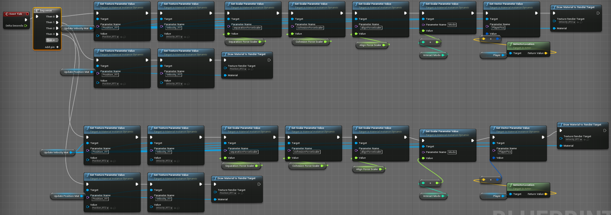

# UE4 GPGPU Flocking/Boids

This DEMO used GPGPU to implement boids algorithm in UE4 and achieved the flocking movement of 10,000 objects. It runs in 60FPS on my laptop with GTX1660Ti, windows 10-64bit. The UE4 version being used is UE4 4.25 preview 7. 

URL of demo video: https://www.youtube.com/watch?v=MqYdyMEQzW4&feature=youtu.be   

## Playing instruction
Using **AWSD** and mouse (the typical FPS control) to navigate the scene.   
I also provide interface allowing players to change the parameter of the boids and play with them.
1. Press **'1' or '2'** to adjust instance Num
2. Press **'3' or '4'** to adjust align force scale
3. Press **'5' or '6'** to adjust cohesion force scale
4. Press **'7' or '8'** to adjust separation force scale
5. Press **'P'** to enter Predator Mode (the boids will avoid player)
6. Press **'C'** to enter Chasing Mode (the boids will chase player)
7. Press **'N'** to go back to Normal Mode (there are no interaction between boids and player, player acts as a observers)

## Implementation description
### 1.	Rendering boids
I did some experiments before I start to implement it. Using the spawn function to generate 1000 actors with the same staticMesh, the runtime frame rate drops to the single digits. It seems that UE4 did not batch render the 1000 identical objects. I have some experience with untiy3d, I remember there is an option to automatically batch rendering in untiy3d, but I didn't find it in unreal. Please tell me how to do that if some of you guys have experience with it.   
Then it is natural to come up with the idea that using GPU instancing to generate boids. UE4 provides a component called the instatncedStaticMesh for gpu instancing. As its name suggests, it use instancing to render large quantities of static Mesh. Calling instatncedStaticMesh: : updateInstanceTranform is very slow! So the question is, how do we get static mesh instatnces moving? I got the inspiration for this [video](https://www.youtube.com/watch?v=LQBgJBC0jhE) and this [blog](https://qiita.com/selflash/items/c937308299d93340f7c7). We can use the **world Position Offset** in the material to change the Position of each instance. Then, how to get instanceID for each instance? There is no built-in method to get the instanceID unitl UE4 4.25. Thus, author of the blog, [@selflash](https://github.com/selflash) used the position of the instance in the initialization time to calculate their instanceIDs(that is a enlightening idea).  Fortunately, during the search I found that the **Set CustomData Value** function is provided in the latest UE4 4.25 (preview7) to save their own CustomData for each instance, and can be accessed in the material via **PerInstanceCCustomData**! So we can specify instanceID for every instatnces now. (I have to complain that UE4 4.25 preview7 is not very stable and has crashed many times in the process of use for no reason).
### 2.	Applying GPGPU to update boids
To take advantage of the gpu's powerful parallel computing capabilities, I  use custom node and HLSL code to calculate the position and velocity for every instance of boids in the material.  
In the Demo, 2 100* 100 renderTarget2Ds (called **Position_RT1** and **Position_RT2** in the project file) are used to store position data for each instance, where each pixel represents the location of an instance.For example, the location information for an instance with instanceId of 0 is stored at UV = (0, 0).The location of the instanceId 1 instance is at UV = (1/100, 0).   
Similarly, 2 100* 100 renderTarget2Ds (**Velocity_RT1** and **Velocity_RT2**) are used to store velocity data for each instance.  
**VelocityUpdate_mat** [Material] is a Material used to calculate and update velocity, using three  custom nodes to calculate the acceleration contributed by separation, cohesion and align. Corresponding HLSL code located on the Shaders folder.The updated velocities will be rendered to renderTarget2D (**Velocity_RT1** and **Velocity_RT2**).   
**PositionUpdate_mat**[Material] is a Material used to calculate and update the position. It simply adds velocity to the current position to get the new position.The updated locations will be rendered to renderTarget2D (**Position_RT1** and **Position_RT2** in the demo project).   
**DrawInstances_mat**[Material] is the Material assigned to instances, which reads Position_RT2 to render each instance where it should be.   
In **BP_InstancingRootActor**[Blueprint], 'ping-pong' updates position and velocity and render them into renderTarget2Ds.
   
C++ is mainly for initializing component, clearing and changing the amount of instances.

## Future works
I originally intended to use compute shader for computation, but I cannot make have it imported as a plugin. There is little information about it available online, and even the [official tutorials](https://docs.unrealengine.com/en-US/Programming/Rendering/ShaderInPlugin/QuickStart/index.html) are not up to date.(The ShaderCore module is no longer available after UE4 4.21, but the tutorial still tries to import this module in the build.cs file.). I will conutinue to explore how to make it correct.
GPU particle and Niagara sytem are aslo schemes worth exploring to implement grouping behavior.

## References
[THE NATURE OF CODE Chapter 6. Autonomous Agents](https://natureofcode.com/book/chapter-6-autonomous-agents/)   
[Manipulate 125,000 Cubes with GPGPU - Unreal Engine 4](https://www.youtube.com/watch?v=LQBgJBC0jhE)   
[[UE4]ブループリントだけでGPGPUをしよう ~ その1 インスタンスIDを割り振る ~](https://qiita.com/selflash/items/c937308299d93340f7c7)   
Many thanks to [@selflash](https://github.com/selflash) for helping me solve the problem of floating point texture accuracy!

